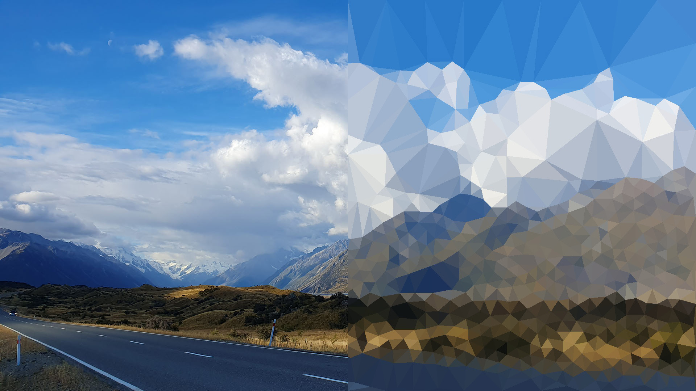

# Triangulate
Small python scripts that render images with triangles to give them a low polygon look.

### Prerequisites
A Python3+ installation and the python libraries in `requirements.txt`:
```
python -m pip install -r requirements.txt
```

### Usage
The easiest way is to use the command line function with the default values:
```
python ./triangulate/main.py -i ./example/colour.jpg -o ./example/test.jpg
```

The two main options are `--corner` and `--radial` which both take integer values as input:
```
python ./triangulate/main.py -i ./example/colour.jpg -o ./example/test_20_20.jpg --corner 20 --radial 20
```

The `--corner` flag sets the threshold for the [FAST corner detection](https://vovkos.github.io/doxyrest-showcase/opencv/sphinx_rtd_theme/page_tutorial_py_fast.html) algorithm. Higher values detect fewer corners.
The `--radial` flag sets the minium radial distance allowed between vertices of the triangles, effectively setting the minim size of the triangles. The value is given in pixel units.

You can get a list of the command line flags and options with:
```
python ./triangulate/main.py --help
```
